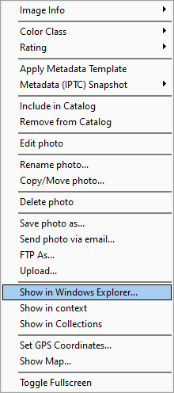
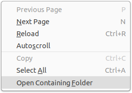
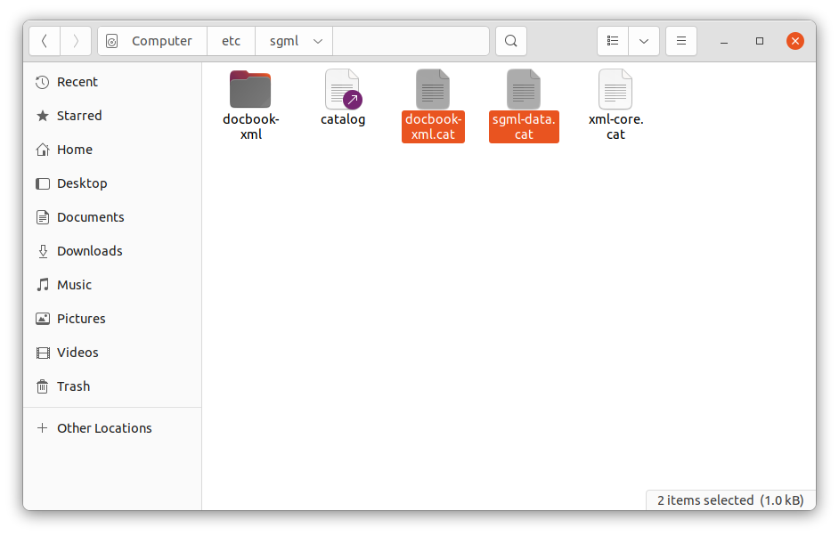

# Show in File Manager

Platform independent way for a Python script to open the system file manager and optionally select files to highlight
in it. The point is not to _open_ the file, but to _select_ it in the operating system's file manager.

Plenty of programs provide this functionality in their user interface. Phrases programs use to name it vary depending on
the context. Windows programs use terms like "Show in Windows Explorer", "Show in Explorer", and "Reveal in Explorer".
Cross-platform programs can prefer terms like "Open Containing Folder" or "Open in File Browser".
On a downloading program, a term can be "Open destination folder".




The command results in the file manager opening, typically with the files selected:


## Rationale

There is no standard command line argument with which to open an operating system's file manager and select files at a
specified path. Moreover, not all file managers support specifying files to select &mdash;
if you try to pass a file to these file managers, they will open the file instead of selecting it, or display an error
message.

On desktop Linux the problem is especially acute, as Linux provides a plethora of file managers, with varying command
line arguments. Moreover, the system default file manager can sometimes be incorrectly set to nonsensical values,
such as an AppImage or Flatpak the user installed.

To work around these problems, this module maintains a list of desktops, their associated file managers, the commands
the file managers accept, and any limitations these file managers have:

|File Manager|Used by|Command line       |Can Select Files|Accepts URI  |Accepts Path|Handles Multiple Files / Directories|Notes|
|------------|-------|-------------------|:---:|:---:|:---:|:---:|----|
| Windows File Explorer|Windows 10 / 11| `explorer.exe /select,URI`|:white_check_mark:|:white_check_mark:|:white_check_mark:|:x:|No space between comma and URI. Can specify only one URI.|
| Nautilus (Files)|Gnome, Pop OS, Zorin|`nautilus --select URI1 URI2`|:white_check_mark:|:white_check_mark:|:white_check_mark:|:warning:|Multiple URIs open multiple Nautilus windows.|
|Dolphin|KDE|`dolphin --select URI1 URI2 `|:white_check_mark:|:white_check_mark:|:white_check_mark:|:white_check_mark:|`--select` functionality fails in some recent KDE releases, but is working in KDE Neon testing.|
|Nemo|Linux Mint|`nemo URI1 URI2`|:white_check_mark:|:white_check_mark:|:white_check_mark:|:warning:|Multiple URIs open multiple Nemo windows.|
|Pantheon|Elementary OS|`io.elementary.files URI1 URI2`|:white_check_mark:|:white_check_mark:|:white_check_mark:|:warning:| Multiple URIs open multiple Pantheon tabs.|
|Deepin File Manager|Deepin|`dde-file-manager --show-item URI1 URI2`|:white_check_mark:|:white_check_mark:|:white_check_mark:|:warning:| Multiple URIs open multiple Deepin File Manager tabs.|
|Peony|Ubuntu Kylin|`peony --show-items URI1 URI2`|:white_check_mark:|:white_check_mark:|:white_check_mark:|:white_check_mark:| |
|Caja|Mate|`caja URI`|:x:|:white_check_mark:|:white_check_mark:|:warning:|Specifying a file causes an error. Multiple URIs open multiple Caja windows.|
|Thunar|XFCE|`thunar`|:x:|:white_check_mark:|:white_check_mark:|:warning:|Specifying a file opens it. Multiple URIs open multiple Thunar windows.|
|PCManFM|LXDE|`pcmanfm URI`|:x:|:white_check_mark:|:white_check_mark:|:x:|Specifying a file opens it. Multiple URIs open only the first URI.|
|PCManFM-Qt|LXQt|`pcmanfm-qt`|:x:|:white_check_mark:|:white_check_mark:|:white_check_mark:|Specifying a file opens it. Multiple URIs open multiple PCManFM-Qt windows.|


## Usage

The module performs two tasks:
 - Probes the operating system's default file manager using the function `probe_system_file_manager`
 - Shows a file or directory in the file manager using the function ```show_in_file_manager```.

The function `probe_system_file_manager` determines the file manager being used, and sets its value in a module level
global variable. By default, `probe_system_file_manager` is called by ```show_in_file_manager``` if it has not been
previously called.  You can specifiy whether to accept to use the custom setting (even if it is nonsensical), or specify
a default based on the detected desktop environment.

The function ```show_in_file_manager```, accepts zero or more URIs / paths. If you specify paths, they will be converted
to a URI. For file managers that cannot select files, the directory will be displayed.

## Examples

Show file in file manager, accepting default settings:
```python
show_in_file_manager('C:\Documents\myfile.txt')                                # Windows path
show_in_file_manager('file://C:/Documents/myfile.txt')                         # Windows URI
show_in_file_manager('/home/user/myfile.txt')                                  # Linux path
show_in_file_manager(('/home/user/myfile.txt', '/home/user/myotherfile.txt'))  # Linux multiple paths
show_in_file_manager('file:///home/user/myfile.txt')                           # Linux URI
show_in_file_manager()                                                         # Simply open the file manager
show_in_file_manager('/home/user')                                             # Open the file manager at a directory
```

Probe desktop environment and behavior in Linux and set module level variables to record them:
```python
probe_system_file_manager()                     # Accept whatever the default file manager setting is for system
probe_system_file_manager(force_standard=True)  # Use the standard file manager for the desktop, ignoring custom user settings 
```

### Windows Notes

On Windows, it is assumed the only file manager is `explorer.exe`.

### Linux Notes
The file manager is probed using `xdg-mime query default inode/directory`.  

The module provides the Linux only function ```determine_linux_file_manager``` that returns file manager settings with
setting the module to use them.

## Limitations

 - The code is in a preliminary state. Critiques are welcome.
 - Characters like é in path names currently fail.
 - It currently does not work at all on OS X.
 - It's performance in a confined Linux environment like a Flatpak or Snap is untested. 
 - It is intended that this code be uploaded to PyPi when it is in better shape.

## Contributing

Please file issues or pull requests to improve the code. Discuss improvements in the GitHub discussion section for 
this project.

Much of this code is originally from [Rapid Photo Downloader](https://github.com/damonlynch/rapid-photo-downloader).


## License

[MIT](https://choosealicense.com/licenses/mit/)

  
## Authors

- [@damonlynch](https://github.com/damonlynch)


